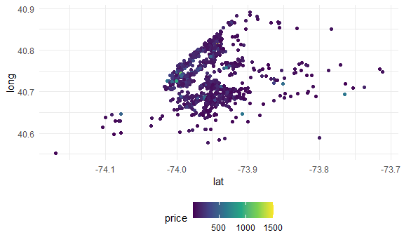

Case Study
================
Jessica Flynn

``` r
library(tidyverse)
```

    ## -- Attaching packages -------------------------------- tidyverse 1.3.0 --

    ## v ggplot2 3.3.2     v purrr   0.3.4
    ## v tibble  3.0.3     v dplyr   1.0.2
    ## v tidyr   1.1.2     v stringr 1.4.0
    ## v readr   1.3.1     v forcats 0.5.0

    ## -- Conflicts ----------------------------------- tidyverse_conflicts() --
    ## x dplyr::filter() masks stats::filter()
    ## x dplyr::lag()    masks stats::lag()

``` r
library(p8105.datasets)
library(leaflet)

theme_set(theme_minimal() + theme(legend.position = "bottom"))

options(
  ggplot2.continuous.colour = "viridis",
  ggplot2.continuous.fill = "viridis"
)

scale_colour_discrete = scale_colour_viridis_d
scale_fill_discrete = scale_fill_viridis_d

knitr::opts_chunk$set(
  fig.width = 6,
  fig.asp = .6,
  out.width = "90%"
)
```

``` r
data(nyc_airbnb)
```

## Brainstorm some questions

  - what is the best Airbnb in Staten island for less than $100?
  - what price range is popular in each borough ? most rented ?
  - what apartment features are related to price?
  - cheapest room type in each neighborhood ?
  - hosts have higher ratings?

data cleaning

``` r
nyc_airbnb = 
  nyc_airbnb %>% 
  mutate(stars = review_scores_location / 2)
```

## Answer some questions

``` r
nyc_airbnb %>%
  count(neighbourhood_group, room_type) %>% 
  pivot_wider(names_from = room_type, 
              values_from = n)
```

    ## # A tibble: 5 x 4
    ##   neighbourhood_group `Entire home/apt` `Private room` `Shared room`
    ##   <chr>                           <int>          <int>         <int>
    ## 1 Bronx                             192            429            28
    ## 2 Brooklyn                         7427           9000           383
    ## 3 Manhattan                       10814           7812           586
    ## 4 Queens                           1388           2241           192
    ## 5 Staten Island                     116            144             1

``` r
nyc_airbnb %>% 
  group_by(neighbourhood_group, room_type) %>% 
  summarize(mean_price = mean(price))
```

    ## `summarise()` regrouping output by 'neighbourhood_group' (override with `.groups` argument)

    ## # A tibble: 15 x 3
    ## # Groups:   neighbourhood_group [5]
    ##    neighbourhood_group room_type       mean_price
    ##    <chr>               <chr>                <dbl>
    ##  1 Bronx               Entire home/apt      125. 
    ##  2 Bronx               Private room          65.5
    ##  3 Bronx               Shared room           57.5
    ##  4 Brooklyn            Entire home/apt      175. 
    ##  5 Brooklyn            Private room          76.7
    ##  6 Brooklyn            Shared room           59.6
    ##  7 Manhattan           Entire home/apt      238. 
    ##  8 Manhattan           Private room         107. 
    ##  9 Manhattan           Shared room           84.7
    ## 10 Queens              Entire home/apt      140. 
    ## 11 Queens              Private room          70.6
    ## 12 Queens              Shared room           49.1
    ## 13 Staten Island       Entire home/apt      207. 
    ## 14 Staten Island       Private room          65.4
    ## 15 Staten Island       Shared room           25

``` r
nyc_airbnb %>% 
  filter(price < 1000) %>% 
  ggplot(aes(x = neighbourhood_group, y = price)) + 
  geom_boxplot()
```


``` r
nyc_airbnb %>% 
  filter(neighbourhood_group == "Manhattan") %>% 
  count(neighbourhood)
```

    ## # A tibble: 32 x 2
    ##    neighbourhood          n
    ##    <chr>              <int>
    ##  1 Battery Park City     65
    ##  2 Chelsea             1072
    ##  3 Chinatown            360
    ##  4 Civic Center          42
    ##  5 East Harlem         1048
    ##  6 East Village        1858
    ##  7 Financial District   391
    ##  8 Flatiron District     90
    ##  9 Gramercy             307
    ## 10 Greenwich Village    383
    ## # ... with 22 more rows

``` r
nyc_airbnb %>% 
  filter(price < 1000, 
         neighbourhood_group == "Manhattan") %>%
  mutate(neighbourhood = fct_reorder(neighbourhood, price)) %>%
  ggplot(aes(x = neighbourhood, y = price)) + 
  geom_boxplot() + 
  coord_flip()
```


``` r
nyc_airbnb %>% 
  sample_n(1000) %>% 
  ggplot(aes(x = lat, y = long, color = price)) + 
  geom_point()
```



## Create a leaflet map

``` r
pal <- colorNumeric("viridis", nyc_airbnb %>% pull(stars))

nyc_airbnb %>% 
  sample_n(1000) %>% 
  leaflet() %>% 
  addProviderTiles(providers$CartoDB.Positron) %>% 
  addCircleMarkers(~lat, ~long, radius = 1, color = ~pal(stars))
```

<!--html_preserve-->

<div id="htmlwidget-e594764978861083a8b8" class="leaflet html-widget" style="width:90%;height:345.6px;">

</div>

<script type="application/json" data-for="htmlwidget-e594764978861083a8b8">{"x":{"options":{"crs":{"crsClass":"L.CRS.EPSG3857","code":null,"proj4def":null,"projectedBounds":null,"options":{}}},"calls":[{"method":"addProviderTiles","args":["CartoDB.Positron",null,null,{"errorTileUrl":"","noWrap":false,"detectRetina":false}]},{"method":"addCircleMarkers","args":[[40.7303247585779,40.7315407499486,40.7768695651073,40.6640545371168,40.7660171682887,40.6427712852503,40.7670228917012,40.6899381311091,40.8113379815818,40.7215656227169,40.6991632197321,40.7258716987194,40.8530137453312,40.6941730510319,40.8209735698243,40.8217865391286,40.7636308145345,40.795010308555,40.7751171916728,40.6540183171353,40.8374109894194,40.7230396213006,40.8088725037317,40.7653053878097,40.7132981058542,40.7811297147639,40.8122386245911,40.6854322001868,40.716395332824,40.8039329649512,40.7718171388928,40.7189408244161,40.6938332857499,40.7432210899058,40.8045797974674,40.8070580266937,40.7214166365536,40.6884690319093,40.7577893895237,40.6809093267512,40.6849610248796,40.8105535735109,40.7254480446469,40.6915786944007,40.7094734104821,40.7489637369537,40.68190200582,40.8183942112598,40.8002281665461,40.762623226922,40.7210225807431,40.8165593032594,40.6731532488663,40.7629652933479,40.8076124861868,40.6824463681298,40.7268153576218,40.761887634706,40.6797085540891,40.7208600126473,40.8138911153546,40.7066020310608,40.679623199636,40.67560142202,40.6684757768745,40.7591907499227,40.586995605762,40.7086054387246,40.811498258933,40.7104155847085,40.6723977649964,40.7283049928553,40.7604006396421,40.6941969849502,40.829571471764,40.6938731555411,40.6884765798319,40.719544703591,40.6560619705731,40.8031619439584,40.8246796199581,40.7121058911168,40.6611996104363,40.7071478028209,40.5891813202533,40.6376709911458,40.75973581684,40.7842837501274,40.6386782425194,40.6893756368076,40.8243767924074,40.7172295147624,40.7733153256114,40.7313912351769,40.8119405657472,40.79277086824,40.6799479471358,40.7691169309623,40.8024664076604,40.6873743600338,40.7369758044763,40.7333948841584,40.8265127915431,40.7574055159437,40.8181987313331,40.6579850461089,40.7080283835771,40.7800001342584,40.7728756056727,40.6804727126204,40.7527204283266,40.6823578528125,40.8291867874468,40.6344264205448,40.7350626959332,40.7151482624141,40.8003914109301,40.7264743937323,40.7120833324847,40.7345759973961,40.8600608294611,40.7038225216815,40.6723097703487,40.6624403680016,40.8058450900413,40.8267962447618,40.8233701840534,40.7218326337038,40.7636936822148,40.840300995247,40.7842381655268,40.8044249009906,40.8159960836214,40.7228628715463,40.7919488971307,40.6604370708122,40.7508845144347,40.7686365237208,40.8284116087395,40.7328339807897,40.7356914051374,40.7508776797456,40.6747075253609,40.773944934416,40.6977697177215,40.7386468351571,40.7428446619983,40.8787440312381,40.8121731276597,40.810547237095,40.7050366417606,40.7389665708812,40.640303583561,40.8088224374884,40.7282429703922,40.715614411536,40.6945376180247,40.6804942866753,40.7641274873821,40.8126285918478,40.6693033112692,40.6951120647014,40.7380221592416,40.7159930840035,40.7638794902888,40.7247322364882,40.7412480475479,40.6626016009019,40.8112482083151,40.8033932641821,40.6885149542439,40.8024342615067,40.7845084744737,40.8427541881584,40.6923750113207,40.7003520020112,40.7812778200559,40.7294025097098,40.7350112399361,40.75427175698,40.711344168379,40.6729720594666,40.6803505490096,40.7671435876226,40.6881903674815,40.6942168810724,40.7114338363608,40.5904409165837,40.7750022547158,40.7640413903767,40.7214736517375,40.6999265453609,40.8525037016808,40.6803471931433,40.7639159382266,40.8077030763516,40.7610256258456,40.7463658149609,40.753312201941,40.8242658402229,40.7941091689338,40.7062847992972,40.8004476437195,40.7476561475943,40.7337993050304,40.8029216253675,40.7639076104314,40.6503060028074,40.6690868151111,40.7038060425113,40.6992747065224,40.6898932182175,40.6942800857788,40.7148911448109,40.7260128155052,40.703928171565,40.7077423600998,40.7629435224993,40.6625180823368,40.7137761671175,40.7268649750313,40.813202404418,40.7949214840679,40.7259971906099,40.7210509674169,40.7108639891159,40.7715738329042,40.8403774372392,40.8675102763672,40.6713042672847,40.6873211200075,40.7810328321138,40.7931984689941,40.6549923582794,40.7279937715979,40.740354666309,40.8235803449552,40.6927077332326,40.7655185155249,40.8132072675274,40.7670021933123,40.7370266103907,40.7406259231993,40.6852848075162,40.8049001305426,40.642311281048,40.616449401985,40.7171311844436,40.6833773035951,40.7985089095623,40.715946516896,40.6684129841132,40.8344283879915,40.7290979485527,40.6851177960758,40.6769401666832,40.7557481741058,40.7351357009817,40.643717872513,40.7414187553858,40.8148218213009,40.7287776390765,40.752585392224,40.7443271472485,40.8130526341548,40.694286156591,40.7208351701004,40.6857021335036,40.7448544491103,40.7655507000429,40.6916448206129,40.7216833382376,40.7325051597107,40.7984021650756,40.8660368121082,40.7737621554205,40.6838362999626,40.7643247491836,40.6434678714635,40.7724297937764,40.7170849953359,40.6508666336887,40.711021867738,40.6812084722549,40.7323865356162,40.779662034517,40.685237118003,40.8655918422919,40.8636316909011,40.7785419463415,40.6362773369896,40.7221055659624,40.8455775022745,40.7265677307486,40.6952716705576,40.6617786027174,40.7330735354755,40.7323817508863,40.7317544475801,40.7228453295045,40.7936921570417,40.7594440912816,40.8237342823102,40.8705409673822,40.7692412416339,40.6807573411045,40.6974515634967,40.6888280664964,40.7425869934789,40.6828297527599,40.6225000555597,40.7863303100235,40.7185464197128,40.7146597188822,40.6916468726339,40.7562642323309,40.667949814962,40.721407213382,40.6433491519244,40.7034859272243,40.7127114297841,40.7266857514035,40.7093955228217,40.7651261360688,40.5799735420971,40.6954607888195,40.6325642577073,40.7327054570514,40.7277934969338,40.7280374355888,40.6796028051513,40.6163350171093,40.8311701445657,40.7121215286531,40.6549406108864,40.6167852531904,40.774142288332,40.6944463532274,40.7327792687774,40.8677946675045,40.6961326952057,40.7077324172666,40.7354481429665,40.7089750859399,40.6935828393548,40.7027455543479,40.7425740673349,40.6686097480203,40.7412564772469,40.7144463651148,40.638739655028,40.6715570829335,40.6738811685476,40.6606976060485,40.6496168665704,40.7404916236812,40.7984563905455,40.8285601232867,40.7557855816595,40.7413850297534,40.6877368186665,40.7161862572663,40.6214488516807,40.6673657913964,40.7508208778107,40.6428731339239,40.8239250297982,40.7022169066784,40.7383469741493,40.777225471388,40.6666208785666,40.7240122556792,40.7153292190795,40.7899292868743,40.7221159459927,40.7241299907157,40.7461108538024,40.7611200000393,40.7334004560831,40.6912572452269,40.6817218615356,40.8242012466104,40.7432708128986,40.7343282421771,40.7597201857636,40.6653260634646,40.7346247453685,40.6621910598565,40.708445011617,40.7034168009008,40.6946102571364,40.712488048162,40.7273480126742,40.7971722786576,40.7993788998028,40.7873190590516,40.7320691886957,40.7639695343617,40.680757654585,40.6834627490445,40.7201367921151,40.6833060069203,40.7258110051718,40.7439351176743,40.8242098428526,40.6984647238309,40.6700266359719,40.668907103422,40.7189584441445,40.7550348465489,40.7979637296763,40.6836772409578,40.8593556228547,40.7544853790204,40.730574327087,40.7247352881993,40.7289536559935,40.7704896618431,40.7571497152809,40.6896323309207,40.729723913903,40.6719782713009,40.7167668716948,40.7240290644409,40.7652859397647,40.7653311870889,40.8103885566235,40.8046352534433,40.813436150254,40.7138978530327,40.7182074340679,40.7620723899574,40.7385970103886,40.8002735810053,40.7137138817901,40.7440884452638,40.6346477454109,40.710051559179,40.8008219958642,40.7951670548037,40.6790059138202,40.796858870625,40.6958734478154,40.7844754230989,40.7982508516533,40.70035148028,40.7699546644235,40.7004435142006,40.6638256881201,40.8279477533285,40.6912650053956,40.824119597816,40.7935796667502,40.7862939892897,40.7143089398067,40.7225052221657,40.7191010354859,40.6741316743539,40.7912612932968,40.7013040513003,40.6850186337165,40.6824317694053,40.7653828509724,40.7139273643102,40.7087707848837,40.5779127637385,40.7541685438356,40.7199378233289,40.761388343169,40.691431290373,40.7257069965738,40.7628334148332,40.7422147111262,40.6816745885626,40.6772664610186,40.7274239091445,40.7081590360878,40.6812250125227,40.6594877812273,40.6820520733414,40.684774635665,40.7686535232019,40.7605759659894,40.7058542497051,40.6720509245759,40.7153051597859,40.8215775501309,40.7292401667039,40.6779127897122,40.67709946818,40.705719833373,40.7474833342709,40.8314645370704,40.7665310264898,40.6672085944814,40.6466871338467,40.7975121268229,40.7255565063028,40.6716887195165,40.6625285569764,40.7919384819599,40.7446956977354,40.7267250901443,40.6958864828762,40.6980942379798,40.7993874144567,40.7290753261073,40.7975340903964,40.7897385984329,40.8189940577187,40.7827248537244,40.7499716966466,40.8132494846071,40.7600063718109,40.7217684452057,40.6915827193404,40.7343202887795,40.7636950791717,40.6732316801131,40.6505614065029,40.7846053929181,40.7123457663421,40.7147469613227,40.7100384216736,40.7600530966442,40.7522106454878,40.726745228708,40.8165910127793,40.7408767130449,40.7126004381021,40.8166739657299,40.7770603801463,40.6973137191564,40.8221912026017,40.7133280666093,40.715787712726,40.6936113133198,40.7300522557289,40.6838953539999,40.7584776568802,40.781739174201,40.7806319310126,40.7209467924037,40.8245251467429,40.6952704740062,40.7637363409271,40.6993156508278,40.7193586797851,40.7200380123817,40.7092878384109,40.7232816989826,40.6950229108411,40.715487085127,40.7434156542122,40.6872168557167,40.8200400373929,40.6255953692971,40.686279593064,40.683127401364,40.7084024099456,40.7084834228415,40.7788460937925,40.7926501041868,40.7949646799982,40.6866449001992,40.7479144058679,40.7933245803021,40.7331021647508,40.7363809561939,40.7159792489509,40.8257986292609,40.6991252480739,40.6460064622418,40.7762412994989,40.8513883144867,40.7148260676938,40.6934080663833,40.7206387288389,40.6761458326702,40.6950997640063,40.6903288319919,40.6889132260606,40.8014582978965,40.7915379886083,40.7637604455667,40.8070969830586,40.7321359814913,40.646400535293,40.7126718520061,40.7192170286422,40.7490456095415,40.6956761213167,40.68985716173,40.7217106199656,40.7134841797063,40.6620224443858,40.7031783829418,40.7667883654596,40.8188479615626,40.693434436089,40.7350603394767,40.7484317368732,40.7289102088821,40.7210340499841,40.7857369759197,40.6830301988441,40.6436930005317,40.7277054286976,40.8525968639486,40.7397052125507,40.744594512189,40.7000715659509,40.6705445006379,40.6860580716637,40.7353949524941,40.7672948779122,40.6966437361566,40.7614813509183,40.8333324807358,40.8028560836655,40.7071694548476,40.8158591254668,40.7153486970498,40.7071992273609,40.6763935187556,40.6785465340491,40.7139180032938,40.7317360270936,40.7200751707996,40.7530359125765,40.7346176404068,40.7933292191728,40.7010746434608,40.714559065025,40.7151109786017,40.7910136687659,40.7082733422182,40.6982289049167,40.6723851750067,40.7771832654013,40.7643228315985,40.6231912532842,40.680751563544,40.7075977462984,40.638323426355,40.6878210104142,40.7540577448614,40.8202071598321,40.7373149175572,40.8010188640052,40.6693255762587,40.6889977324142,40.7784040912468,40.7102553880058,40.736014342803,40.6477494676693,40.7241109426366,40.6618706055018,40.7433882191614,40.6858992197808,40.8811754720733,40.767119013849,40.8090152331324,40.7155586307191,40.7102188900029,40.7487143884427,40.7301753528895,40.7839561689309,40.7077773374575,40.8507608928014,40.7262314220192,40.6653485009434,40.7933936927054,40.7378739137982,40.7850981838928,40.6786678549274,40.7480860506779,40.6886064447897,40.8449741923628,40.7462090055448,40.7139754956616,40.7190676997484,40.5927370891975,40.6838538897691,40.7526983223173,40.686042328262,40.7001431729049,40.6866721519341,40.7888274275399,40.817259293047,40.6934358806789,40.7576000758637,40.6693298839597,40.619621255652,40.6509599497952,40.720906089451,40.7380199194967,40.7747237247105,40.7546288264761,40.778861657912,40.6409959976182,40.7345619402472,40.7333655469999,40.786742074122,40.7521512757178,40.7214104612789,40.7136487959907,40.6625304959451,40.7773400188493,40.720602424791,40.6406217375079,40.699198329339,40.7671697859351,40.6768930893227,40.776762420464,40.7331701448641,40.82574667942,40.8498505597243,40.7378000314295,40.8028343945458,40.608670475918,40.6909557909213,40.6863876690461,40.6382250751832,40.6835936754378,40.6844344833693,40.8062288527421,40.6981116290372,40.734554989627,40.6619034311955,40.6906345744333,40.8031725909837,40.7594500809391,40.6771656778221,40.7229053395378,40.6775982858186,40.7619138563049,40.7073547038681,40.732397989325,40.8471443906307,40.8409443657506,40.6240179197702,40.7299507433822,40.7506372586369,40.701403387494,40.729694362861,40.7779189232176,40.6737623666259,40.6819666706261,40.7635818925764,40.7329328403495,40.6813423010595,40.7116940925088,40.7134648846434,40.8272147908209,40.8088306990018,40.8243855004215,40.6784338596333,40.5855587360063,40.7651386751195,40.5910404784648,40.6894137011483,40.7248668539611,40.7153347093029,40.7361835164068,40.819062550183,40.7510299866777,40.7444778929646,40.8663306626834,40.6956483733818,40.7564475131655,40.7651601242886,40.7036488594132,40.7190986379551,40.6362445317038,40.6837189021565,40.6717969009456,40.6996596002287,40.7328402426733,40.7417763757701,40.7516985667453,40.6847076252014,40.7268989218879,40.7022867481542,40.8130969517067,40.7324322354736,40.7751353282104,40.7441118281221,40.7826503502279,40.7463987722175,40.5880688762626,40.6340138369644,40.641621285951,40.7878912579086,40.6847653564072,40.7124340367937,40.7654465383614,40.8068457172559,40.7625314290577,40.6774673573806,40.6890064606414,40.6501044017726,40.8181791989606,40.7142330612621,40.712789813843,40.7526390793859,40.827878851411,40.6733715389298,40.7604697722701,40.8086947646364,40.6247638983377,40.7975676593869,40.7987926573249,40.723686242151,40.6785437603306,40.7113925930078,40.7897416802671,40.6866388834291,40.7272633305993,40.6769331487463,40.6490951265114,40.7152710594,40.6598915416637,40.8100435282331,40.6948046609381,40.631766500653,40.6358523527564,40.6606742141978,40.7828635442497,40.6928757867687,40.7338147181108,40.7869777733267,40.7925159700771,40.814432611313,40.7166057011088,40.6971705675554,40.6837395004596,40.7572517809831,40.8087217417637,40.7222864856159,40.7208621525409,40.712416502496,40.7840124635451,40.6835057697959,40.7971867436667,40.6967595579255,40.7731281071937,40.739392415417,40.780890745948,40.6320904341621,40.6890525342137,40.7407999878539,40.7217400363244,40.6839925541479,40.6924443573753,40.7459925933889,40.6776239999147,40.7160581043341,40.7463730045872,40.6894173006175,40.7617769222535,40.6469288838454,40.8760492307273,40.7992994751172,40.7235951322958,40.7224988945957,40.7399909841379,40.6902307264762,40.66148125666,40.7627557195636,40.7219134499715,40.6933212140159,40.7638135463389,40.7699589949778,40.7078354788304,40.7291881414159,40.7014961293119,40.7975720700352,40.7701173902612,40.8048108702849,40.6635173729905,40.6986960380693,40.7460013708875,40.8232165478385,40.7490569265992,40.7694171058105,40.6905492209412,40.8182998977299,40.7356470753184,40.6792848948134,40.6809160460406,40.7089123874848,40.8243799353204,40.5410636890227,40.7573485086062,40.7659194706295,40.7183884680691,40.7925104588388,40.6446498851853,40.7631743274529,40.5899947801684,40.7244175191595,40.7217368596652,40.7100236567332,40.7437895310828,40.7839804243361,40.7927372526402,40.7596816057492,40.7103054602585,40.7179023321461,40.7794299777414,40.6835313465791,40.6838597008432,40.8303380246141,40.7702965960433,40.6725509231189,40.6979095497475,40.688788323634,40.7311901664392,40.7052603123393,40.7467227623751,40.7139815255854,40.736444865368,40.7885068816468,40.6674606055675,40.6858943561011,40.6854250670456,40.7066930441843,40.6863732821205,40.7426279458432,40.6907738467909,40.7509163107978,40.6984566450862,40.7164808346313,40.7673824365124,40.8227353376284,40.6852734549842,40.7064793712059,40.8591614371875,40.7200734886276,40.7995653878203,40.7699853151772,40.7676930917997,40.7981477640964,40.6585396895299,40.7272079292513,40.6510124615292,40.7192707371144,40.7771858740885,40.7010365605811,40.7075819258529,40.6908514504656,40.7236020078053,40.6680978599468,40.6896823284913,40.6970219764518,40.7169214349583,40.7791479288202,40.7671189374001,40.6931827129422,40.7010162399774,40.6677980072715,40.6884329369197,40.7055941570904,40.7467302304209,40.714307069073,40.8155535911219,40.775866581637,40.6846017125972,40.6950610249008,40.710263692345,40.6621056656896,40.8157197537802,40.764910749222,40.8373798152759,40.7211828922205,40.6430523480973,40.693561748982,40.7106691519633,40.6705242229235,40.7297264123014,40.7218571618775,40.7261726312223,40.6949010105768,40.7191989014014,40.7328251861248,40.8425423038794,40.7266700592109,40.7181291355518,40.734114958136,40.7758795046284,40.7576982326493,40.6846032458947,40.7121411651741,40.7656786182436,40.716335373314,40.6710420455997,40.7628633478131,40.7425910456558,40.7240762142866],[-73.9997591995271,-73.9941191042655,-73.9545960204811,-73.8567596064772,-73.9839399339955,-73.9794658283612,-73.9827299880878,-73.9212535570866,-73.9553118278706,-73.9848942832593,-73.9470819111229,-73.9843807524728,-73.8325011138472,-73.9944302006152,-73.954730002607,-73.9411651517929,-73.8665829778181,-73.9713232548051,-73.9775143321225,-73.96072986937,-73.9392807032659,-74.004726158804,-73.9591667442086,-73.9907833635908,-73.9503660150058,-73.9545187456007,-73.9393654867846,-73.9457103018535,-73.9583471264188,-73.9660697771656,-73.9312949729416,-73.9571333358814,-73.974846118116,-73.997442381717,-73.954119277111,-73.9466529427733,-73.9852140063755,-73.9895425924767,-73.8246733747747,-73.9766018076105,-73.9208949896357,-73.9401619477172,-73.954053080928,-73.9570493676987,-73.8292245437696,-73.8071535287658,-73.9540314378727,-73.9369191460349,-73.9667830840834,-73.9867749642938,-73.9963420791147,-73.9612165872802,-73.9502981550586,-73.9912539355407,-73.9541613835894,-73.9577290520433,-73.9873318170258,-73.9896125179238,-73.9628831746082,-73.9804621671528,-73.9520486033237,-74.0039628182162,-73.8892779972898,-73.9502357320413,-73.9800235489311,-73.9183634278646,-73.9558820330934,-73.7985073697172,-73.8560678909837,-73.9590790591673,-73.8883943497603,-73.9834390724292,-73.9921975446808,-73.9063647856828,-73.9453474448133,-73.9134081481493,-73.9900919174708,-73.9974992353562,-73.9590165985193,-73.9534698696849,-73.9388275072067,-74.0159139815571,-73.9856810387435,-73.8146807871725,-73.9254938673445,-73.9563668570165,-73.9865969663086,-73.9487228693961,-73.9504869951908,-73.9694765588867,-73.9433227530795,-73.9630141691472,-73.9526234557384,-73.9877569702719,-73.9411625657549,-73.9761291605415,-73.909218680274,-73.9878885566803,-73.9680025996945,-73.9712514675922,-73.8776261745912,-74.0040291550017,-73.94224862029,-73.9947145353701,-73.9553893037914,-73.949236162667,-74.0173482519726,-73.9824922406255,-73.9241918352288,-73.9538061890403,-73.968412649393,-73.9431375789746,-73.9403100254823,-73.9670256897509,-73.9920290971615,-73.9370564781507,-73.9684326886032,-73.9906130297033,-73.9379267739081,-74.0027951121289,-73.908907141753,-73.7395497920804,-73.9442640255778,-73.9581267088883,-73.9471697093643,-73.9050711195566,-73.9452933188618,-73.9490845490732,-73.9160076126893,-73.9383342439308,-73.9764447333983,-73.9636163659285,-73.9378533912528,-73.9947134605122,-73.9743433278345,-73.9889250918193,-73.9686286868187,-73.9553713853499,-73.9492195967374,-73.9939962287954,-74.0034125355635,-73.9382355330277,-73.9457070849157,-73.947679400018,-73.9336421212841,-73.9962042279604,-73.9950464213545,-73.8366110012746,-73.9177717986391,-73.9593231848088,-74.0147102388834,-73.8818232686726,-73.9495862755749,-73.9420037303217,-73.9782447066827,-73.9516929822037,-73.9502717429932,-73.9121410841637,-73.9940207035072,-73.8646255636069,-73.9892590609809,-73.952324051966,-73.9734869366282,-73.9473763605878,-73.9221034605029,-73.9519896580147,-73.9886217284979,-73.96135830498,-73.9421726991017,-73.9503413728214,-73.9617439519049,-73.9706001267783,-73.978823776068,-73.9423638296213,-73.9963873604945,-73.9379327872463,-73.9818431650209,-73.9497675084766,-74.0101056699993,-73.9927956530847,-73.9502049630109,-73.9578216790477,-73.9716215105863,-73.9830528228883,-73.915972350212,-73.9808946408236,-74.0059641880595,-73.8133830652467,-73.9507104103299,-73.9808065335823,-73.9880571376339,-73.9137007157077,-73.9364268127787,-73.9623857408672,-73.9952387697109,-73.9388987536618,-73.9917839731062,-73.9746895469797,-73.9732981788858,-73.9397638352356,-73.9677005069623,-73.9454051510628,-73.9543816130813,-73.9185626772781,-74.0032765487077,-73.9473065561258,-73.9922460334952,-74.0017574140719,-73.9514399345384,-73.9431535626603,-73.9213332938889,-73.9543837405119,-73.9414832661657,-73.990995179693,-74.0009821610605,-73.8965220699393,-73.9481944633577,-73.9148636169559,-73.984333981098,-73.9508612568149,-73.949263270331,-73.9358664812573,-73.9408718648478,-74.0010124651736,-73.9813975137931,-73.9608781351236,-73.9069795291686,-73.9435647721771,-73.9265569287187,-73.9432882350927,-73.982539997836,-73.9506907375332,-73.9400654022696,-73.9618967080435,-73.990098215942,-73.9909799043028,-73.9462346469495,-73.9936487706478,-73.910293697232,-73.9523348561849,-73.9305057439269,-73.8586148305552,-73.9984274411984,-73.9911923632216,-73.9638223584765,-73.9797383766244,-74.0310798445417,-74.0005709526251,-73.9063840970537,-73.9606280693269,-73.9910101157156,-73.9362133801549,-73.942327294899,-73.9778073968891,-73.9980275101945,-73.981303237435,-73.9684198180283,-73.999538104054,-73.9596878768836,-73.820200327137,-73.9508040204317,-73.9852119404042,-73.9706057255648,-73.9854558101127,-73.9546616819949,-73.9677149495772,-73.9784980713235,-73.9708830468917,-73.9180256117285,-73.9902799065312,-73.9283449641394,-73.9883763838645,-73.988463771658,-73.9446580673494,-73.9273176925953,-73.9185480361477,-73.9981277600333,-73.9887057114732,-73.9926724601245,-73.9574414420966,-73.9427835709158,-73.9636335703207,-73.9448793788166,-74.0018702499667,-73.954487666733,-73.9169620844509,-73.9407318169183,-73.9217419326251,-73.9300225237818,-73.9498053590746,-74.0776281344819,-73.9835875057007,-73.9426212590648,-74.0063893977603,-73.9478647638589,-73.9451662272485,-73.9834993908933,-73.9980505533781,-73.9951824557067,-73.9940942304101,-73.9653934058363,-73.9976604705659,-73.9514350334733,-73.8468070882334,-73.9906961905255,-73.9575082382524,-73.9252714996529,-73.9618855349315,-73.9888594102082,-73.9981297655553,-73.9257760295415,-73.9536553889378,-73.9917266679397,-73.9627934295111,-73.9672399767552,-73.9691287412043,-73.9805326260503,-73.9870346994063,-73.9674502505218,-73.8993988855584,-73.9610048894696,-73.9841883008054,-73.948729065423,-73.9930943943837,-73.9611879255505,-73.8506225281663,-73.9475677871172,-74.0054505039488,-73.943231197702,-74.0037059682575,-73.9302186705101,-74.0337819931391,-73.8756554510017,-73.9890545071999,-74.0043450061716,-73.960161528017,-73.9162460020741,-73.9445919846164,-73.9946199289691,-73.9210079366069,-73.9475138638871,-73.9427514983798,-73.9823842201135,-73.9479597765179,-73.9486281938157,-73.9328823224218,-73.9854937219312,-73.9828614067316,-73.9808262052659,-73.9515147530661,-74.0152690761676,-73.9836644766964,-73.965561736443,-73.9913081199265,-74.0002792982177,-73.9811250211057,-73.9332432325087,-73.9376943848535,-73.9938384164103,-74.0005043408797,-73.9154975768096,-73.9751806206463,-74.018315949226,-73.9366114652412,-73.8944748506728,-73.9022752671192,-73.9241358598042,-73.9229097336949,-73.922036925927,-73.9487881928278,-73.9537399365865,-73.7290055879228,-73.9372111716484,-73.9471766531482,-73.9882820490633,-73.9511250387651,-73.9129520062713,-73.9907480981732,-73.9814400566661,-73.9877181554893,-73.9409505923317,-73.9452877277684,-74.0060141120274,-73.9821551881609,-73.9913915909404,-73.9917752216439,-73.8570494316743,-73.9223525005936,-73.9556356237483,-73.9282859997379,-73.9287441793456,-73.8494248784486,-73.9492236489346,-73.9428666598531,-73.9623534194796,-73.9748871918238,-74.006242529071,-73.9624471560112,-73.9896040961074,-73.9637353238205,-73.9617331885367,-73.9533904550863,-73.9888445022366,-73.9987881658211,-73.946050199845,-73.9931209704399,-73.9740014055827,-73.9533043742428,-73.956725788107,-73.8274188133153,-73.9350479023741,-73.9611031000356,-73.9282054956238,-73.9140365482982,-73.9821844453047,-73.9950596989706,-73.9878933578778,-73.9588290880294,-73.91309463903,-73.9951693836461,-73.9799524850989,-73.9301124539632,-73.9821161107829,-73.9505518155123,-73.9771250198005,-73.9616267220347,-73.9407887210201,-73.9494318508323,-73.950073912562,-73.946276635158,-73.9821283127404,-73.9889499831592,-73.9977492534351,-73.9677514823729,-73.962356013428,-73.9247105855108,-74.023660917917,-73.9656775676626,-73.9605932161906,-73.9757733547296,-73.9521806586371,-73.9458991703773,-73.9095995236141,-73.9786063032916,-73.9679148242004,-73.9434022640615,-73.9819823363495,-73.9283748500073,-73.9270551571927,-73.9424847030015,-73.9955231277367,-73.9026553583992,-73.9745229442449,-73.9553278561321,-73.9563445802981,-73.9995670796833,-73.9854085068014,-73.9591636405214,-73.9466328724919,-73.928131034286,-73.9930557652064,-73.9065457160252,-73.7709220427515,-73.9510850732278,-73.9521435726637,-73.9846978060767,-73.9223015402828,-73.9560576061382,-73.9984300152381,-73.9343563090354,-73.8494442168457,-73.9949065256344,-73.9982232250068,-73.9252527655039,-73.943148490265,-73.9896760296567,-74.0139978508335,-73.9561939455105,-73.9424597039418,-73.9778103979783,-73.9389875367252,-73.9525849854194,-73.993271267868,-74.011759243822,-73.7534339352397,-73.9343713039697,-73.9533000067258,-73.9870101521344,-73.9665637765995,-73.9599371055641,-73.8807745475967,-74.0057048527746,-73.947573764765,-73.992144349204,-73.9825638555435,-73.9588979423737,-73.932705052496,-73.9410416886793,-73.9743551544922,-73.9844424648265,-73.9393072922462,-73.9714808748573,-73.9800427268903,-73.8995321664915,-73.9343466763213,-73.9547043397102,-73.9997334258691,-73.9621117034935,-73.9701767681166,-73.946940723733,-73.9827210936741,-73.7881532179227,-73.9512026943293,-73.9877927891979,-73.9828571893834,-73.9558464839799,-73.9972033307679,-73.980038150371,-73.9514024067877,-73.9636907599999,-73.978060586424,-73.9442524024182,-73.9912022615785,-73.9564410447449,-73.9887134045053,-73.9715704385962,-73.9860048146504,-73.9352763988389,-73.985202855206,-73.9951782181418,-73.9569472544985,-73.9840668466516,-73.982283896308,-73.9493889620839,-73.9406474298593,-73.9924000572269,-73.9525912085028,-73.9871489666401,-74.0004758489183,-73.9720476763748,-73.9482870348745,-73.9503693838515,-73.9789948991715,-73.9492347359577,-73.9478412095915,-73.9942207437536,-73.9178092903152,-74.0031882626719,-73.9435217057,-74.0109392107137,-73.9985170212061,-73.9125928496262,-73.94712074493,-73.9766062126877,-73.9840361498014,-73.9382530348657,-74.0205759925892,-73.9602237317638,-73.9638099452005,-73.9508466016672,-73.7665314733758,-73.9817809161089,-73.9710799371177,-73.9458264031757,-73.944135437964,-74.0013293477108,-73.9410502536717,-73.9583733137136,-74.0069128225906,-73.9922494564483,-73.9455642069704,-73.918138307634,-73.9488552621924,-73.9466990024114,-73.9305714964173,-73.9442741695795,-73.9469247598652,-73.9849365599215,-73.9544073768328,-73.9814980580732,-73.9968947623007,-73.9762808401619,-73.9533506238289,-73.9423306632669,-73.9878856455052,-73.9503839579828,-74.0018760119507,-73.9642086424074,-73.951931100003,-73.9425916904589,-73.9018521753533,-73.9338373706476,-73.9920980578164,-73.9957458091442,-73.9913475027656,-73.9858926283099,-73.9878012262082,-73.8305277185657,-73.9595162249365,-73.9961065544651,-74.0051781087703,-73.8806082572754,-74.0010914380588,-73.9479756783033,-73.9704656303685,-73.9306207447192,-73.8900979899571,-74.000091399413,-73.8993830409651,-74.0022134367523,-73.9929057707394,-73.9433802696862,-73.8792034706171,-73.9339080466986,-74.0081844853873,-73.7716214682352,-73.9292105622505,-73.9948855622942,-73.9448029194383,-73.965605512706,-73.9436587324918,-73.9411650650565,-73.9570251080842,-73.7985278044898,-73.960027417396,-74.0007454103451,-73.9621576646536,-74.0030885843615,-73.9446409720445,-73.9720807744969,-73.9526061083239,-73.9407506236078,-73.9198256189064,-73.9409969921037,-73.9579822720961,-73.9796145106326,-73.9474865417305,-73.943100679484,-73.7381936997707,-73.9267594470904,-73.9859892852927,-74.0140338498858,-73.947248387233,-73.9407244220409,-73.9565121674335,-73.9097771443081,-73.9360887690851,-73.9445161652605,-73.9549333757193,-73.962827858184,-73.9251981173177,-73.9176770435596,-73.9800684516966,-73.9516473587891,-73.9876061044952,-73.9712020065299,-74.0012010151208,-73.991305925991,-73.997748588415,-73.9576027681015,-73.9029506444659,-73.9863753844619,-73.94214132014,-73.9923407421333,-73.9868683518034,-73.9768016060857,-73.9852849695667,-73.9521846072027,-73.9555392958341,-73.9304923804883,-73.9497152813337,-73.9509266113716,-73.9403001129335,-74.0067043886756,-73.9525392728154,-73.9228190026746,-73.9758711047649,-73.8082858554768,-73.9393427597223,-73.9778269442365,-73.958333677355,-73.9570351601881,-74.1617828954085,-73.9522954752514,-73.9905110747177,-73.9318738943559,-73.9072828876706,-73.9622655036405,-73.97201054206,-73.9434435761217,-73.9590862257002,-73.9899681261069,-73.9543051684298,-74.0148591342639,-73.9639507808505,-73.9765171991203,-73.9055707942764,-73.9815592152815,-73.9744504117375,-73.9804168805245,-74.0163548897485,-73.8562426404135,-74.001970755344,-73.9479780469256,-73.9391278673276,-73.9816047697227,-73.9458031200208,-73.9441368898867,-73.9459235113061,-73.943824958311,-73.9473313315807,-73.9451831464928,-73.9531660562257,-73.9396669588746,-73.9147521922518,-74.0011760524858,-73.9242059490793,-73.9402455232352,-73.8821900008425,-73.9650363088219,-73.9583350131106,-73.9721018483792,-73.9554807231063,-73.957718375709,-73.9269010241619,-74.0039209945194,-73.9404744762235,-73.92577744516,-73.9548920221891,-73.8669714311201,-73.9572656622721,-73.9476852787565,-73.9889510113269,-73.9403987547108,-73.9797174100694,-73.9401888720909,-73.8309188120581,-73.9519353807813,-73.9970844801383,-73.9417242300503,-73.9369303861733,-73.9707118728964,-73.9549823346926,-73.8906677121072,-73.9179812016827,-74.0041799222498,-73.9538967431371,-73.9410645264436,-73.9945601091514,-73.9885902115032,-73.9795022182858,-73.92225751312,-73.9419310459382,-73.995917601724,-73.9377252616978,-73.9457721731394,-73.940138927574,-73.9638539404038,-74.1614816280837,-73.9855051142766,-73.7889207889792,-73.9564427460946,-73.9866310786276,-73.9950779728417,-74.000423550028,-73.9565373276436,-73.9834878575462,-73.9922141481044,-73.8564284936043,-73.9966273546463,-73.9976682761015,-73.9586771548199,-73.8957171080704,-73.9962761193631,-73.9636510098878,-73.9199361868436,-73.9426640310467,-73.9324104197332,-73.9582241805474,-73.9731323570491,-73.8939312202509,-73.910159899147,-73.8395163847564,-73.9431680502687,-73.9479860476384,-73.986923987968,-73.907978195123,-73.9742326422872,-73.9536372009474,-73.9766879174437,-73.8067424446851,-74.0028293946016,-73.9471253535693,-73.9742712972207,-73.9982493737727,-73.9565505978314,-73.9566807634,-73.9240228568642,-73.9893931725043,-73.7649315415844,-73.9405437507016,-73.9798491032263,-73.9390505591187,-73.994420522518,-73.9585166923257,-73.9678854536557,-73.9462112758579,-73.9622795890848,-73.986488559227,-73.9420541601577,-73.9239808271638,-73.9380011707601,-73.9672124846911,-73.9752955875171,-73.9685562285965,-73.9417594925758,-73.9466941407493,-73.9207553368664,-73.9895596556286,-73.9587210152015,-73.9743356602842,-73.9363244428969,-73.9821452123527,-73.9601588851098,-73.9416132217002,-73.963411479109,-73.9695472655732,-73.9379625272136,-73.9726611167154,-73.9659226442407,-73.9812913434765,-73.9440035732033,-73.9399549340621,-73.9615994976373,-73.9551049921442,-73.965886794205,-74.0015040836889,-73.9667110128721,-73.9422812976359,-73.9885814154669,-73.9940695643269,-73.9500913346624,-73.9743821783905,-73.9322404468132,-73.9372375880729,-73.9477300110091,-73.9470294126606,-73.9830029257098,-73.9839527113144,-74.1149445584275,-73.9461722810927,-74.0012712797048,-73.9792519430225,-73.9619180032062,-73.9972136798407,-73.997753916109,-73.9709685993725,-73.9513461606606,-73.9910177225237,-73.9597805511809,-73.9880255152097,-73.9563559939248,-73.8804709016151,-73.9528424314116,-73.9846631388715,-73.9893979808063,-73.9812223704798,-73.9808646972564,-73.9894166284233,-73.8330960838825,-73.9420727262489,-73.9654294738401,-73.9871818411561,-73.9587494542412,-73.942057866453,-73.9451151998558,-73.9266038848551,-73.9400555054449,-73.9008800319075,-73.9479445381483,-73.9600515018447,-73.9115044222703,-73.9168606702244,-73.9500771076772,-73.9968305418141,-73.9596552768291,-73.9207101964067,-73.8673801469224,-73.9243426705897,-73.9779071889409,-73.953363660404,-73.9497522159243,-73.9446536929197,-74.1466574196566,-73.9213393477486,-73.960449222699,-73.9432939577623,-73.9451708116362,-74.0927246864766,-73.9678652049204,-73.9256654271171,-73.9832202694827,-73.9948186779989,-73.9580200732573,-73.9127673981818,-73.9504645289003,-73.9398168821347,-73.9925053751618,-74.01557458937,-73.9477945142254,-73.95207504389,-73.9914020312991,-74.0011277182322,-73.9490178259306,-73.9128310137547,-73.9491431494585,-73.9327567287007,-73.9518096083872,-73.9881904281148,-73.9196390722214,-74.0055540791417,-73.936810363738,-74.0040086603037,-73.9758428126297,-73.9940819066982,-73.9765931410719,-73.9329378225233,-74.0021448420506,-73.9113305323354,-73.9247603265142,-73.9574531247177,-73.9863588660937,-73.912017389413,-73.9912041938212,-73.9178520761338,-73.9385219298422,-73.9113247699838,-74.0086888818269,-73.932806072955,-73.9561470636743,-73.9646801366582,-73.9665083035624,-73.9879963679245,-73.9616786241893,-73.9507066740071,-73.9783420852712,-73.9551731256555,-73.9994318652533,-73.9543110540013,-73.9181347107841,-73.954205286278,-73.9557827110932,-73.9762130707379,-73.9831944994954,-73.9840418264803,-73.9336506169587,-73.9635313185045,-73.9517080966908,-73.9878893729003,-73.9055968563941,-73.9247631314792,-73.9244162361565,-73.9453680982174,-73.9355172563026,-73.9734255876294,-73.9434693307306,-73.9582477155117,-73.9798239714826,-73.9447829751992,-73.9280898324418,-73.9684070183555,-73.95125204193,-73.9483154608563,-73.9206988711452,-73.9399086150971,-73.9806551591559,-73.9995934117902,-73.9454166447883,-73.9869545929063,-73.956206103232,-73.9797286182925,-73.9961174524238,-73.9830500917695,-73.9581788875734,-73.9913940881171,-74.0054251830583,-73.9436727111879,-74.0025672145713,-73.9871485207802,-73.9978733213838,-73.9078157632066,-73.931095901548,-73.9653616322459,-73.9616524559978,-73.9778970943158,-73.9555972944571,-73.9385857539641,-73.9912859733007,-73.9970778777031,-73.9395219885842],1,null,null,{"interactive":true,"className":"","stroke":true,"color":["#FDE725","#FDE725","#FDE725","#AADC32","#808080","#FDE725","#808080","#AADC32","#AADC32","#808080","#AADC32","#FDE725","#FDE725","#FDE725","#AADC32","#AADC32","#AADC32","#FDE725","#FDE725","#AADC32","#AADC32","#FDE725","#FDE725","#808080","#808080","#FDE725","#808080","#FDE725","#FDE725","#808080","#AADC32","#AADC32","#808080","#808080","#808080","#AADC32","#AADC32","#FDE725","#5DC863","#FDE725","#21908D","#AADC32","#FDE725","#5DC863","#AADC32","#AADC32","#FDE725","#5DC863","#FDE725","#FDE725","#808080","#808080","#808080","#FDE725","#808080","#808080","#FDE725","#FDE725","#808080","#808080","#AADC32","#AADC32","#5DC863","#AADC32","#FDE725","#AADC32","#AADC32","#FDE725","#5DC863","#808080","#FDE725","#FDE725","#FDE725","#808080","#AADC32","#808080","#FDE725","#FDE725","#808080","#AADC32","#808080","#AADC32","#FDE725","#AADC32","#808080","#808080","#FDE725","#FDE725","#AADC32","#FDE725","#AADC32","#808080","#808080","#808080","#AADC32","#FDE725","#5DC863","#AADC32","#FDE725","#AADC32","#AADC32","#FDE725","#AADC32","#FDE725","#27AD81","#FDE725","#808080","#FDE725","#AADC32","#808080","#FDE725","#5DC863","#AADC32","#5DC863","#AADC32","#5DC863","#808080","#FDE725","#FDE725","#808080","#5DC863","#AADC32","#5DC863","#AADC32","#5DC863","#808080","#5DC863","#FDE725","#FDE725","#AADC32","#808080","#FDE725","#FDE725","#AADC32","#FDE725","#AADC32","#808080","#FDE725","#808080","#808080","#FDE725","#FDE725","#AADC32","#AADC32","#FDE725","#808080","#FDE725","#AADC32","#808080","#808080","#AADC32","#AADC32","#27AD81","#FDE725","#FDE725","#FDE725","#808080","#808080","#FDE725","#21908D","#808080","#5DC863","#808080","#FDE725","#AADC32","#FDE725","#808080","#FDE725","#FDE725","#808080","#AADC32","#FDE725","#808080","#FDE725","#FDE725","#808080","#FDE725","#AADC32","#808080","#808080","#FDE725","#FDE725","#FDE725","#FDE725","#5DC863","#FDE725","#FDE725","#FDE725","#FDE725","#FDE725","#808080","#FDE725","#FDE725","#FDE725","#AADC32","#AADC32","#FDE725","#808080","#FDE725","#FDE725","#808080","#FDE725","#AADC32","#808080","#FDE725","#AADC32","#FDE725","#AADC32","#808080","#808080","#808080","#808080","#AADC32","#808080","#FDE725","#808080","#FDE725","#808080","#808080","#808080","#808080","#AADC32","#AADC32","#FDE725","#808080","#FDE725","#AADC32","#FDE725","#5DC863","#AADC32","#808080","#FDE725","#AADC32","#FDE725","#808080","#AADC32","#FDE725","#FDE725","#AADC32","#FDE725","#FDE725","#AADC32","#FDE725","#808080","#808080","#808080","#808080","#FDE725","#AADC32","#FDE725","#FDE725","#FDE725","#FDE725","#FDE725","#FDE725","#FDE725","#FDE725","#FDE725","#AADC32","#AADC32","#AADC32","#FDE725","#FDE725","#FDE725","#FDE725","#AADC32","#AADC32","#FDE725","#FDE725","#FDE725","#FDE725","#FDE725","#FDE725","#FDE725","#FDE725","#AADC32","#FDE725","#FDE725","#808080","#808080","#808080","#AADC32","#AADC32","#5DC863","#FDE725","#808080","#808080","#AADC32","#AADC32","#FDE725","#AADC32","#FDE725","#FDE725","#808080","#AADC32","#27AD81","#AADC32","#FDE725","#FDE725","#FDE725","#FDE725","#AADC32","#808080","#AADC32","#FDE725","#AADC32","#AADC32","#FDE725","#FDE725","#FDE725","#5DC863","#808080","#AADC32","#808080","#FDE725","#AADC32","#FDE725","#808080","#808080","#FDE725","#808080","#FDE725","#FDE725","#FDE725","#FDE725","#AADC32","#808080","#FDE725","#808080","#FDE725","#AADC32","#AADC32","#808080","#808080","#808080","#808080","#808080","#27AD81","#FDE725","#808080","#FDE725","#FDE725","#808080","#FDE725","#FDE725","#808080","#FDE725","#FDE725","#808080","#FDE725","#5DC863","#808080","#FDE725","#5DC863","#FDE725","#AADC32","#808080","#808080","#808080","#808080","#AADC32","#808080","#FDE725","#5DC863","#AADC32","#5DC863","#FDE725","#808080","#808080","#FDE725","#FDE725","#808080","#FDE725","#808080","#FDE725","#FDE725","#FDE725","#808080","#AADC32","#FDE725","#AADC32","#AADC32","#808080","#808080","#FDE725","#5DC863","#AADC32","#808080","#FDE725","#FDE725","#808080","#FDE725","#AADC32","#27AD81","#AADC32","#FDE725","#808080","#FDE725","#FDE725","#AADC32","#808080","#AADC32","#FDE725","#808080","#808080","#FDE725","#FDE725","#FDE725","#808080","#808080","#5DC863","#FDE725","#808080","#808080","#AADC32","#FDE725","#FDE725","#FDE725","#AADC32","#808080","#FDE725","#27AD81","#AADC32","#AADC32","#808080","#AADC32","#FDE725","#AADC32","#808080","#808080","#AADC32","#FDE725","#AADC32","#AADC32","#FDE725","#FDE725","#AADC32","#808080","#808080","#808080","#AADC32","#5DC863","#AADC32","#FDE725","#808080","#5DC863","#808080","#AADC32","#5DC863","#FDE725","#FDE725","#808080","#AADC32","#FDE725","#808080","#808080","#FDE725","#AADC32","#808080","#AADC32","#FDE725","#5DC863","#FDE725","#808080","#AADC32","#AADC32","#FDE725","#FDE725","#AADC32","#AADC32","#808080","#FDE725","#FDE725","#AADC32","#5DC863","#FDE725","#AADC32","#FDE725","#FDE725","#808080","#AADC32","#FDE725","#FDE725","#AADC32","#808080","#5DC863","#808080","#FDE725","#FDE725","#5DC863","#AADC32","#AADC32","#AADC32","#808080","#FDE725","#FDE725","#808080","#FDE725","#FDE725","#FDE725","#808080","#FDE725","#FDE725","#808080","#808080","#FDE725","#808080","#FDE725","#FDE725","#FDE725","#808080","#FDE725","#808080","#FDE725","#5DC863","#FDE725","#FDE725","#FDE725","#808080","#FDE725","#808080","#808080","#AADC32","#FDE725","#FDE725","#FDE725","#FDE725","#FDE725","#FDE725","#AADC32","#808080","#808080","#FDE725","#808080","#FDE725","#FDE725","#AADC32","#FDE725","#FDE725","#FDE725","#AADC32","#FDE725","#FDE725","#AADC32","#AADC32","#FDE725","#5DC863","#808080","#FDE725","#FDE725","#FDE725","#5DC863","#FDE725","#FDE725","#FDE725","#AADC32","#FDE725","#AADC32","#808080","#808080","#AADC32","#808080","#FDE725","#808080","#808080","#808080","#AADC32","#FDE725","#808080","#808080","#5DC863","#AADC32","#AADC32","#FDE725","#5DC863","#FDE725","#FDE725","#FDE725","#AADC32","#FDE725","#FDE725","#FDE725","#808080","#FDE725","#FDE725","#AADC32","#FDE725","#AADC32","#FDE725","#FDE725","#808080","#AADC32","#FDE725","#FDE725","#FDE725","#FDE725","#FDE725","#808080","#AADC32","#808080","#808080","#808080","#808080","#FDE725","#FDE725","#FDE725","#808080","#808080","#5DC863","#FDE725","#FDE725","#AADC32","#808080","#5DC863","#FDE725","#FDE725","#AADC32","#808080","#AADC32","#808080","#FDE725","#AADC32","#FDE725","#FDE725","#FDE725","#FDE725","#FDE725","#FDE725","#AADC32","#FDE725","#AADC32","#808080","#808080","#AADC32","#FDE725","#FDE725","#808080","#808080","#5DC863","#AADC32","#FDE725","#AADC32","#AADC32","#FDE725","#808080","#AADC32","#AADC32","#21908D","#AADC32","#AADC32","#27AD81","#5DC863","#808080","#5DC863","#FDE725","#808080","#FDE725","#FDE725","#FDE725","#AADC32","#FDE725","#FDE725","#808080","#AADC32","#808080","#808080","#808080","#AADC32","#FDE725","#AADC32","#FDE725","#AADC32","#FDE725","#808080","#FDE725","#AADC32","#FDE725","#AADC32","#AADC32","#808080","#FDE725","#FDE725","#FDE725","#FDE725","#808080","#27AD81","#AADC32","#808080","#FDE725","#FDE725","#AADC32","#808080","#808080","#808080","#808080","#5DC863","#FDE725","#808080","#FDE725","#FDE725","#FDE725","#AADC32","#FDE725","#FDE725","#AADC32","#27AD81","#FDE725","#5DC863","#808080","#FDE725","#5DC863","#808080","#FDE725","#AADC32","#FDE725","#FDE725","#808080","#FDE725","#808080","#808080","#5DC863","#FDE725","#AADC32","#FDE725","#FDE725","#AADC32","#FDE725","#808080","#808080","#5DC863","#AADC32","#AADC32","#FDE725","#5DC863","#FDE725","#FDE725","#FDE725","#FDE725","#808080","#5DC863","#FDE725","#5DC863","#808080","#808080","#FDE725","#FDE725","#FDE725","#5DC863","#FDE725","#FDE725","#808080","#AADC32","#FDE725","#FDE725","#AADC32","#FDE725","#808080","#FDE725","#FDE725","#808080","#AADC32","#808080","#FDE725","#2C728E","#FDE725","#808080","#FDE725","#FDE725","#AADC32","#808080","#FDE725","#808080","#808080","#FDE725","#5DC863","#AADC32","#AADC32","#AADC32","#FDE725","#AADC32","#808080","#808080","#FDE725","#FDE725","#808080","#FDE725","#808080","#AADC32","#FDE725","#FDE725","#AADC32","#FDE725","#808080","#FDE725","#FDE725","#808080","#808080","#AADC32","#808080","#AADC32","#808080","#FDE725","#5DC863","#FDE725","#AADC32","#FDE725","#AADC32","#FDE725","#AADC32","#808080","#FDE725","#FDE725","#AADC32","#AADC32","#FDE725","#FDE725","#AADC32","#FDE725","#FDE725","#AADC32","#AADC32","#AADC32","#FDE725","#808080","#AADC32","#808080","#AADC32","#27AD81","#FDE725","#808080","#808080","#5DC863","#5DC863","#808080","#808080","#AADC32","#808080","#FDE725","#FDE725","#FDE725","#FDE725","#FDE725","#FDE725","#AADC32","#808080","#808080","#FDE725","#FDE725","#FDE725","#AADC32","#FDE725","#808080","#AADC32","#5DC863","#808080","#FDE725","#808080","#5DC863","#808080","#5DC863","#FDE725","#808080","#AADC32","#AADC32","#FDE725","#808080","#AADC32","#808080","#AADC32","#27AD81","#FDE725","#FDE725","#FDE725","#FDE725","#AADC32","#AADC32","#808080","#5DC863","#FDE725","#AADC32","#FDE725","#AADC32","#808080","#AADC32","#FDE725","#808080","#AADC32","#FDE725","#2C728E","#FDE725","#5DC863","#808080","#AADC32","#FDE725","#FDE725","#808080","#FDE725","#FDE725","#AADC32","#FDE725","#808080","#FDE725","#808080","#AADC32","#FDE725","#FDE725","#FDE725","#FDE725","#AADC32","#808080","#FDE725","#FDE725","#FDE725","#AADC32","#808080","#FDE725","#FDE725","#5DC863","#5DC863","#808080","#FDE725","#FDE725","#808080","#FDE725","#5DC863","#AADC32","#FDE725","#FDE725","#FDE725","#AADC32","#AADC32","#FDE725","#808080","#AADC32","#27AD81","#808080","#FDE725","#808080","#AADC32","#FDE725","#AADC32","#FDE725","#808080","#AADC32","#5DC863","#AADC32","#808080","#FDE725","#AADC32","#5DC863","#FDE725","#FDE725","#808080","#FDE725","#808080","#808080","#FDE725","#AADC32","#FDE725","#808080","#5DC863","#5DC863","#AADC32","#FDE725","#AADC32","#FDE725","#808080","#AADC32","#AADC32","#21908D","#FDE725","#AADC32","#FDE725","#AADC32","#808080","#FDE725","#5DC863","#808080","#808080","#FDE725","#27AD81","#FDE725","#FDE725","#FDE725","#AADC32","#FDE725","#808080","#808080","#FDE725","#FDE725","#FDE725","#FDE725","#FDE725","#FDE725","#808080","#FDE725","#808080","#AADC32","#FDE725","#808080"],"weight":5,"opacity":0.5,"fill":true,"fillColor":["#FDE725","#FDE725","#FDE725","#AADC32","#808080","#FDE725","#808080","#AADC32","#AADC32","#808080","#AADC32","#FDE725","#FDE725","#FDE725","#AADC32","#AADC32","#AADC32","#FDE725","#FDE725","#AADC32","#AADC32","#FDE725","#FDE725","#808080","#808080","#FDE725","#808080","#FDE725","#FDE725","#808080","#AADC32","#AADC32","#808080","#808080","#808080","#AADC32","#AADC32","#FDE725","#5DC863","#FDE725","#21908D","#AADC32","#FDE725","#5DC863","#AADC32","#AADC32","#FDE725","#5DC863","#FDE725","#FDE725","#808080","#808080","#808080","#FDE725","#808080","#808080","#FDE725","#FDE725","#808080","#808080","#AADC32","#AADC32","#5DC863","#AADC32","#FDE725","#AADC32","#AADC32","#FDE725","#5DC863","#808080","#FDE725","#FDE725","#FDE725","#808080","#AADC32","#808080","#FDE725","#FDE725","#808080","#AADC32","#808080","#AADC32","#FDE725","#AADC32","#808080","#808080","#FDE725","#FDE725","#AADC32","#FDE725","#AADC32","#808080","#808080","#808080","#AADC32","#FDE725","#5DC863","#AADC32","#FDE725","#AADC32","#AADC32","#FDE725","#AADC32","#FDE725","#27AD81","#FDE725","#808080","#FDE725","#AADC32","#808080","#FDE725","#5DC863","#AADC32","#5DC863","#AADC32","#5DC863","#808080","#FDE725","#FDE725","#808080","#5DC863","#AADC32","#5DC863","#AADC32","#5DC863","#808080","#5DC863","#FDE725","#FDE725","#AADC32","#808080","#FDE725","#FDE725","#AADC32","#FDE725","#AADC32","#808080","#FDE725","#808080","#808080","#FDE725","#FDE725","#AADC32","#AADC32","#FDE725","#808080","#FDE725","#AADC32","#808080","#808080","#AADC32","#AADC32","#27AD81","#FDE725","#FDE725","#FDE725","#808080","#808080","#FDE725","#21908D","#808080","#5DC863","#808080","#FDE725","#AADC32","#FDE725","#808080","#FDE725","#FDE725","#808080","#AADC32","#FDE725","#808080","#FDE725","#FDE725","#808080","#FDE725","#AADC32","#808080","#808080","#FDE725","#FDE725","#FDE725","#FDE725","#5DC863","#FDE725","#FDE725","#FDE725","#FDE725","#FDE725","#808080","#FDE725","#FDE725","#FDE725","#AADC32","#AADC32","#FDE725","#808080","#FDE725","#FDE725","#808080","#FDE725","#AADC32","#808080","#FDE725","#AADC32","#FDE725","#AADC32","#808080","#808080","#808080","#808080","#AADC32","#808080","#FDE725","#808080","#FDE725","#808080","#808080","#808080","#808080","#AADC32","#AADC32","#FDE725","#808080","#FDE725","#AADC32","#FDE725","#5DC863","#AADC32","#808080","#FDE725","#AADC32","#FDE725","#808080","#AADC32","#FDE725","#FDE725","#AADC32","#FDE725","#FDE725","#AADC32","#FDE725","#808080","#808080","#808080","#808080","#FDE725","#AADC32","#FDE725","#FDE725","#FDE725","#FDE725","#FDE725","#FDE725","#FDE725","#FDE725","#FDE725","#AADC32","#AADC32","#AADC32","#FDE725","#FDE725","#FDE725","#FDE725","#AADC32","#AADC32","#FDE725","#FDE725","#FDE725","#FDE725","#FDE725","#FDE725","#FDE725","#FDE725","#AADC32","#FDE725","#FDE725","#808080","#808080","#808080","#AADC32","#AADC32","#5DC863","#FDE725","#808080","#808080","#AADC32","#AADC32","#FDE725","#AADC32","#FDE725","#FDE725","#808080","#AADC32","#27AD81","#AADC32","#FDE725","#FDE725","#FDE725","#FDE725","#AADC32","#808080","#AADC32","#FDE725","#AADC32","#AADC32","#FDE725","#FDE725","#FDE725","#5DC863","#808080","#AADC32","#808080","#FDE725","#AADC32","#FDE725","#808080","#808080","#FDE725","#808080","#FDE725","#FDE725","#FDE725","#FDE725","#AADC32","#808080","#FDE725","#808080","#FDE725","#AADC32","#AADC32","#808080","#808080","#808080","#808080","#808080","#27AD81","#FDE725","#808080","#FDE725","#FDE725","#808080","#FDE725","#FDE725","#808080","#FDE725","#FDE725","#808080","#FDE725","#5DC863","#808080","#FDE725","#5DC863","#FDE725","#AADC32","#808080","#808080","#808080","#808080","#AADC32","#808080","#FDE725","#5DC863","#AADC32","#5DC863","#FDE725","#808080","#808080","#FDE725","#FDE725","#808080","#FDE725","#808080","#FDE725","#FDE725","#FDE725","#808080","#AADC32","#FDE725","#AADC32","#AADC32","#808080","#808080","#FDE725","#5DC863","#AADC32","#808080","#FDE725","#FDE725","#808080","#FDE725","#AADC32","#27AD81","#AADC32","#FDE725","#808080","#FDE725","#FDE725","#AADC32","#808080","#AADC32","#FDE725","#808080","#808080","#FDE725","#FDE725","#FDE725","#808080","#808080","#5DC863","#FDE725","#808080","#808080","#AADC32","#FDE725","#FDE725","#FDE725","#AADC32","#808080","#FDE725","#27AD81","#AADC32","#AADC32","#808080","#AADC32","#FDE725","#AADC32","#808080","#808080","#AADC32","#FDE725","#AADC32","#AADC32","#FDE725","#FDE725","#AADC32","#808080","#808080","#808080","#AADC32","#5DC863","#AADC32","#FDE725","#808080","#5DC863","#808080","#AADC32","#5DC863","#FDE725","#FDE725","#808080","#AADC32","#FDE725","#808080","#808080","#FDE725","#AADC32","#808080","#AADC32","#FDE725","#5DC863","#FDE725","#808080","#AADC32","#AADC32","#FDE725","#FDE725","#AADC32","#AADC32","#808080","#FDE725","#FDE725","#AADC32","#5DC863","#FDE725","#AADC32","#FDE725","#FDE725","#808080","#AADC32","#FDE725","#FDE725","#AADC32","#808080","#5DC863","#808080","#FDE725","#FDE725","#5DC863","#AADC32","#AADC32","#AADC32","#808080","#FDE725","#FDE725","#808080","#FDE725","#FDE725","#FDE725","#808080","#FDE725","#FDE725","#808080","#808080","#FDE725","#808080","#FDE725","#FDE725","#FDE725","#808080","#FDE725","#808080","#FDE725","#5DC863","#FDE725","#FDE725","#FDE725","#808080","#FDE725","#808080","#808080","#AADC32","#FDE725","#FDE725","#FDE725","#FDE725","#FDE725","#FDE725","#AADC32","#808080","#808080","#FDE725","#808080","#FDE725","#FDE725","#AADC32","#FDE725","#FDE725","#FDE725","#AADC32","#FDE725","#FDE725","#AADC32","#AADC32","#FDE725","#5DC863","#808080","#FDE725","#FDE725","#FDE725","#5DC863","#FDE725","#FDE725","#FDE725","#AADC32","#FDE725","#AADC32","#808080","#808080","#AADC32","#808080","#FDE725","#808080","#808080","#808080","#AADC32","#FDE725","#808080","#808080","#5DC863","#AADC32","#AADC32","#FDE725","#5DC863","#FDE725","#FDE725","#FDE725","#AADC32","#FDE725","#FDE725","#FDE725","#808080","#FDE725","#FDE725","#AADC32","#FDE725","#AADC32","#FDE725","#FDE725","#808080","#AADC32","#FDE725","#FDE725","#FDE725","#FDE725","#FDE725","#808080","#AADC32","#808080","#808080","#808080","#808080","#FDE725","#FDE725","#FDE725","#808080","#808080","#5DC863","#FDE725","#FDE725","#AADC32","#808080","#5DC863","#FDE725","#FDE725","#AADC32","#808080","#AADC32","#808080","#FDE725","#AADC32","#FDE725","#FDE725","#FDE725","#FDE725","#FDE725","#FDE725","#AADC32","#FDE725","#AADC32","#808080","#808080","#AADC32","#FDE725","#FDE725","#808080","#808080","#5DC863","#AADC32","#FDE725","#AADC32","#AADC32","#FDE725","#808080","#AADC32","#AADC32","#21908D","#AADC32","#AADC32","#27AD81","#5DC863","#808080","#5DC863","#FDE725","#808080","#FDE725","#FDE725","#FDE725","#AADC32","#FDE725","#FDE725","#808080","#AADC32","#808080","#808080","#808080","#AADC32","#FDE725","#AADC32","#FDE725","#AADC32","#FDE725","#808080","#FDE725","#AADC32","#FDE725","#AADC32","#AADC32","#808080","#FDE725","#FDE725","#FDE725","#FDE725","#808080","#27AD81","#AADC32","#808080","#FDE725","#FDE725","#AADC32","#808080","#808080","#808080","#808080","#5DC863","#FDE725","#808080","#FDE725","#FDE725","#FDE725","#AADC32","#FDE725","#FDE725","#AADC32","#27AD81","#FDE725","#5DC863","#808080","#FDE725","#5DC863","#808080","#FDE725","#AADC32","#FDE725","#FDE725","#808080","#FDE725","#808080","#808080","#5DC863","#FDE725","#AADC32","#FDE725","#FDE725","#AADC32","#FDE725","#808080","#808080","#5DC863","#AADC32","#AADC32","#FDE725","#5DC863","#FDE725","#FDE725","#FDE725","#FDE725","#808080","#5DC863","#FDE725","#5DC863","#808080","#808080","#FDE725","#FDE725","#FDE725","#5DC863","#FDE725","#FDE725","#808080","#AADC32","#FDE725","#FDE725","#AADC32","#FDE725","#808080","#FDE725","#FDE725","#808080","#AADC32","#808080","#FDE725","#2C728E","#FDE725","#808080","#FDE725","#FDE725","#AADC32","#808080","#FDE725","#808080","#808080","#FDE725","#5DC863","#AADC32","#AADC32","#AADC32","#FDE725","#AADC32","#808080","#808080","#FDE725","#FDE725","#808080","#FDE725","#808080","#AADC32","#FDE725","#FDE725","#AADC32","#FDE725","#808080","#FDE725","#FDE725","#808080","#808080","#AADC32","#808080","#AADC32","#808080","#FDE725","#5DC863","#FDE725","#AADC32","#FDE725","#AADC32","#FDE725","#AADC32","#808080","#FDE725","#FDE725","#AADC32","#AADC32","#FDE725","#FDE725","#AADC32","#FDE725","#FDE725","#AADC32","#AADC32","#AADC32","#FDE725","#808080","#AADC32","#808080","#AADC32","#27AD81","#FDE725","#808080","#808080","#5DC863","#5DC863","#808080","#808080","#AADC32","#808080","#FDE725","#FDE725","#FDE725","#FDE725","#FDE725","#FDE725","#AADC32","#808080","#808080","#FDE725","#FDE725","#FDE725","#AADC32","#FDE725","#808080","#AADC32","#5DC863","#808080","#FDE725","#808080","#5DC863","#808080","#5DC863","#FDE725","#808080","#AADC32","#AADC32","#FDE725","#808080","#AADC32","#808080","#AADC32","#27AD81","#FDE725","#FDE725","#FDE725","#FDE725","#AADC32","#AADC32","#808080","#5DC863","#FDE725","#AADC32","#FDE725","#AADC32","#808080","#AADC32","#FDE725","#808080","#AADC32","#FDE725","#2C728E","#FDE725","#5DC863","#808080","#AADC32","#FDE725","#FDE725","#808080","#FDE725","#FDE725","#AADC32","#FDE725","#808080","#FDE725","#808080","#AADC32","#FDE725","#FDE725","#FDE725","#FDE725","#AADC32","#808080","#FDE725","#FDE725","#FDE725","#AADC32","#808080","#FDE725","#FDE725","#5DC863","#5DC863","#808080","#FDE725","#FDE725","#808080","#FDE725","#5DC863","#AADC32","#FDE725","#FDE725","#FDE725","#AADC32","#AADC32","#FDE725","#808080","#AADC32","#27AD81","#808080","#FDE725","#808080","#AADC32","#FDE725","#AADC32","#FDE725","#808080","#AADC32","#5DC863","#AADC32","#808080","#FDE725","#AADC32","#5DC863","#FDE725","#FDE725","#808080","#FDE725","#808080","#808080","#FDE725","#AADC32","#FDE725","#808080","#5DC863","#5DC863","#AADC32","#FDE725","#AADC32","#FDE725","#808080","#AADC32","#AADC32","#21908D","#FDE725","#AADC32","#FDE725","#AADC32","#808080","#FDE725","#5DC863","#808080","#808080","#FDE725","#27AD81","#FDE725","#FDE725","#FDE725","#AADC32","#FDE725","#808080","#808080","#FDE725","#FDE725","#FDE725","#FDE725","#FDE725","#FDE725","#808080","#FDE725","#808080","#AADC32","#FDE725","#808080"],"fillOpacity":0.2},null,null,null,null,null,{"interactive":false,"permanent":false,"direction":"auto","opacity":1,"offset":[0,0],"textsize":"10px","textOnly":false,"className":"","sticky":true},null]}],"limits":{"lat":[40.5410636890227,40.8811754720733],"lng":[-74.1617828954085,-73.7290055879228]}},"evals":[],"jsHooks":[]}</script>

<!--/html_preserve-->

``` r
  nyc_airbnb %>% 
  group_by(neighbourhood_group) %>%
  mutate(min_price = min(price, na.rm = TRUE)) %>% 
  filter(price == min_price)
```

    ## # A tibble: 10 x 19
    ## # Groups:   neighbourhood_group [5]
    ##        id review_scores_l~ name  host_id host_name neighbourhood_g~
    ##     <dbl>            <dbl> <chr>   <dbl> <chr>     <chr>           
    ##  1 1.61e7               NA Adve~  1.05e8 Amardeep  Staten Island   
    ##  2 1.58e7               NA Larg~  1.06e7 Bryan     Brooklyn        
    ##  3 1.67e7                9 Quai~  1.03e7 Gregory   Manhattan       
    ##  4 1.83e7               NA Mode~  2.33e6 Bunmi     Manhattan       
    ##  5 1.52e7               10 Stor~  2.12e7 Jose      Queens          
    ##  6 1.57e7               NA Couc~  9.64e6 Mary      Staten Island   
    ##  7 1.80e7               NA Jen ~  8.45e7 Jennifer  Manhattan       
    ##  8 1.75e7                9 Nice~  8.61e7 Jonathan  Bronx           
    ##  9 1.29e7               10 Turt~  7.05e7 Leonardo  Manhattan       
    ## 10 1.03e7               NA hrly~  5.29e7 Jay       Manhattan       
    ## # ... with 13 more variables: neighbourhood <chr>, lat <dbl>, long <dbl>,
    ## #   room_type <chr>, price <dbl>, minimum_nights <dbl>,
    ## #   number_of_reviews <dbl>, last_review <date>, reviews_per_month <dbl>,
    ## #   calculated_host_listings_count <dbl>, availability_365 <dbl>, stars <dbl>,
    ## #   min_price <dbl>
